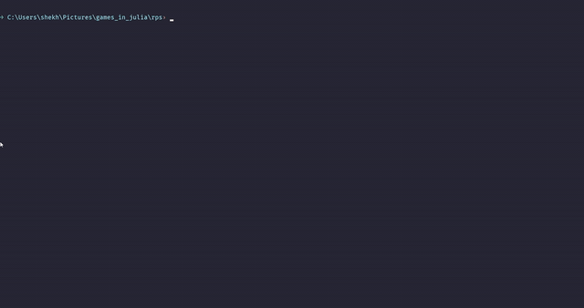

#

```python
                      __                                               
_______  ____   ____ |  | __         ___________  ______   ___________ 
\_  __ \/  _ \_/ ___\|  |/ /  ______ \____ \__  \ \____ \_/ __ \_  __ \
 |  | \(  <_> )  \___|    <  /_____/ |  |_> > __ \|  |_> >  ___/|  | \/
 |__|   \____/ \___  >__|_ \         |   __(____  /   __/ \___  >__|   
                   \/     \/         |__|       \/|__|        \/       
                       .__                                  
           ______ ____ |__| ______ _________________  ______
  ______  /  ___// ___\|  |/  ___//  ___/  _ \_  __ \/  ___/
 /_____/  \___ \\  \___|  |\___ \ \___ (  <_> )  | \/\___ \ 
         /____  >\___  >__/____  >____  >____/|__|  /____  >
              \/     \/        \/     \/                 \/ 
```

## Task Statement

Make a rock-paper-scissors game in Julia **without if/else statements**.
For this task, you will be creating a Rock-Paper-Scissors game in Julia. The game should be single-player and be played against an AI that you make.

This should be pretty straightforward so the caveat for this task is that you **must not use if/else statements** and are instead restricted to the use of the **Ternary Operator** which you can learn about more [here.](https://docs.julialang.org/en/v1/manual/control-flow/#man-conditional-evaluation-1)

- Create a Julia program that is a single-player Rock-Paper-Scissors game.
- Upload the code to GitHub as a Gist, Notebook, or Repository and link it here.
- Provide screenshots on GitHub of how the game is played.

Note that you can not use if/else statements.

## Demo GIF

